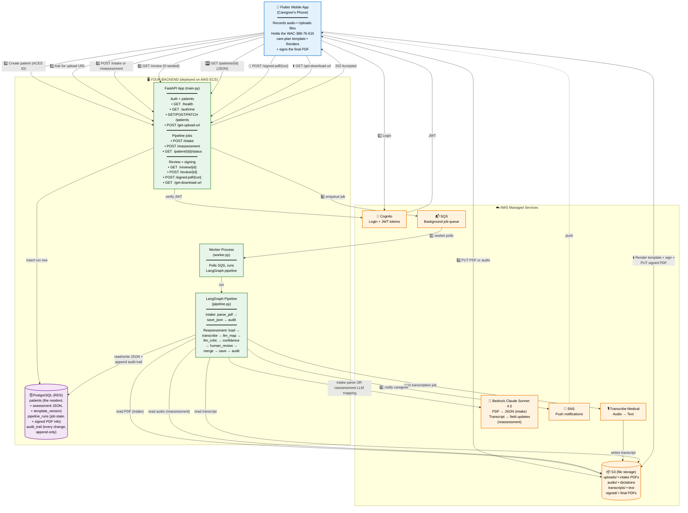

# Samni Labs — Backend Architecture

A one-page picture of how the system works. Written for everyone — caregivers, regulators, the CEO, and the engineering team. No prior knowledge of AWS or databases is assumed.

For step-by-step user scenarios in plain language, see [SYSTEM_FLOW.md](SYSTEM_FLOW.md).
For the AI pipeline internals, see [PIPELINE.md](PIPELINE.md).
For the REST API contract Flutter uses, see [API_ENDPOINTS.md](API_ENDPOINTS.md).

---

## What this product does, in one sentence

> A caregiver at a Washington state Adult Family Home updates a resident's care plan by either uploading the existing PDF or recording a voice note — the backend turns both into structured data, the caregiver reviews and signs the result on their phone, and the signed PDF is archived in AWS for compliance.

---

## Architecture diagram

---

## How to view this as a picture

- **GitHub / GitLab** — open this file in the web UI; the diagram renders automatically.
- **VS Code** — install the "Markdown Preview Mermaid Support" extension and press `Ctrl+Shift+V` on this file.
- **Export PNG / SVG** — paste the diagram block at [mermaid.live](https://mermaid.live).

---

## Colour legend

| Colour | Meaning |
|---|---|
| 🔵 Blue | The Flutter mobile app on the caregiver's phone |
| 🟠 Orange | AWS managed services (AWS runs these for us) |
| 🟢 Green | Our backend code (FastAPI + Worker + Pipeline) |
| 🟣 Purple | The PostgreSQL database (Amazon RDS in production) |

---

## What each numbered arrow means

| Step | Plain-language explanation |
|------|---|
| 1️⃣ | Caregiver logs in. AWS Cognito checks their password and gives them a token. Every request to our backend includes that token. |
| 2️⃣ | New resident? Caregiver enters the 9-digit ACES ID and a preferred name. The backend creates a patient row. |
| 3️⃣ | Before uploading anything, Flutter asks the backend for a one-time URL pointing at S3 (valid for 10 minutes). |
| 4️⃣ | Flutter uploads the file directly to S3 using that URL. Our backend never sees the file bytes — it just hands out the URL. |
| 5️⃣ | Once uploaded, Flutter tells the backend "process the PDF" (intake) or "process the audio" (reassessment). |
| 6️⃣ | The backend creates a row in the `pipeline_runs` table and queues a job in AWS SQS. It immediately replies "OK, queued" to Flutter. |
| 7️⃣ | A separate worker process picks the job up from SQS. It runs the LangGraph pipeline — the AI logic that does the actual work. |
|   ↳ Intake | Pipeline reads the PDF from S3, sends it to **AWS Bedrock Claude Sonnet 4.5** which returns the 200+ fields as structured JSON. The JSON is saved to Postgres; every field is recorded in the audit trail. |
|   ↳ Reassessment | Pipeline reads the audio from S3, sends it to **AWS Transcribe Medical** which returns text. That text plus the existing JSON go to **Bedrock Claude** which proposes which fields should change. A second Claude call reviews the proposals and scores confidence. High-confidence ones are auto-applied; low-confidence ones pause for caregiver review. |
| 8️⃣ | Pipeline finishes (or pauses for review). AWS SNS sends a push notification to the phone. |
| 9️⃣ | If updates need review, caregiver opens the app and approves/rejects each one. |
| 🔟 | Caregiver fetches the up-to-date JSON from the backend. |
| ⬆️ | Flutter renders the WAC-388-76-615 care-plan template with all the values filled in, captures the caregiver's on-screen signature, and uploads the finished PDF to S3. |
| 📌 | Flutter tells the backend "here's the signed S3 key for this run" — the backend records it as the legal archive artifact. |
| ⬇️ | Anytime later (printing, emailing the case manager), Flutter asks for a presigned URL to download the latest signed PDF. |

---

## What lives where

| Data | Where | Why there |
|---|---|---|
| The resident's full structured record (200+ fields) | Postgres `patients.assessment` (JSONB) | Queryable, indexed, transactional. |
| Every single change to a resident's data | Postgres `audit_trail` (append-only) | HIPAA requires a tamper-proof history. |
| Status of every processing job | Postgres `pipeline_runs` | So Flutter can show progress and resume after a pause. |
| Uploaded intake PDFs | S3 `uploads/` | Files don't belong in a database. |
| Uploaded audio dictations | S3 `audio/` | Same reason. |
| Transcripts (text from Transcribe Medical) | S3 `transcripts/` | Cached so re-runs don't re-transcribe. |
| Signed final PDFs | S3 `signed/` | The legal archive. |
| The blank WAC-388-76-615 template | Bundled inside the Flutter app | Fixed; ships with each app release. |
| Login passwords | AWS Cognito | Managed, audited, supports MFA. |

---

## One-line summary of the entire system

> The caregiver records a voice note or uploads a PDF on their phone. The file goes straight to AWS S3. Our backend reads it, uses Amazon Transcribe Medical (audio) and Amazon Bedrock Claude (the LLM) to extract the relevant clinical fields, runs a human-in-the-loop safety check for anything uncertain, and saves the result to PostgreSQL with a full audit trail. Flutter then renders the official care-plan PDF with every field filled in, the caregiver signs on-device, and the signed PDF is archived in S3 for compliance.
